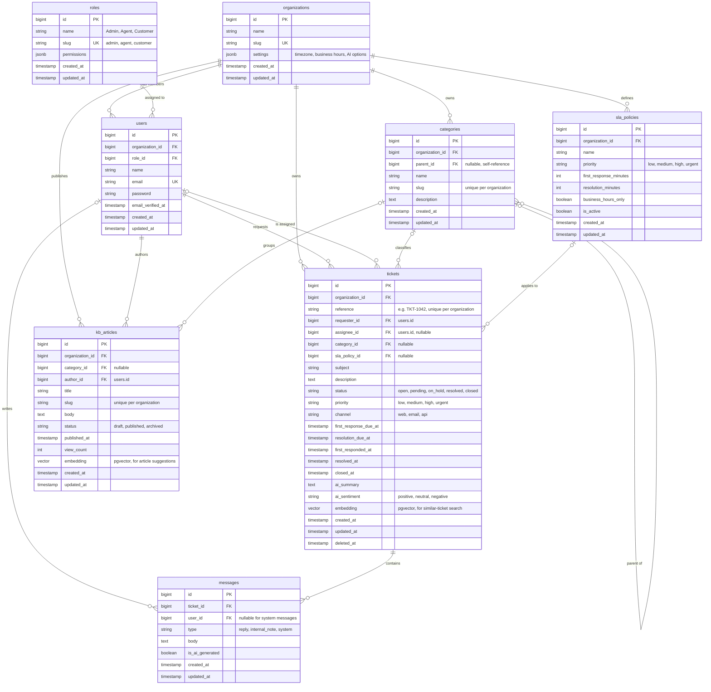

# Entity Relationship Diagram

Core data model for the AI Support Ticketing System. GitHub renders the diagram below automatically; a static copy is in [`erd.png`](erd.png).

## Relationships

| Relationship | Type | Notes |
|---|---|---|
| organizations → users, categories, sla_policies, tickets, kb_articles | one-to-many | Every tenant-owned table has `organization_id`; all queries are scoped by it |
| roles → users | one-to-many | One role per user |
| users → tickets (`requester_id`) | one-to-many | The customer who opened the ticket |
| users → tickets (`assignee_id`) | one-to-many, optional | The agent working on it; null = unassigned |
| tickets → messages | one-to-many | The conversation thread |
| users → messages | one-to-many, optional | Null author = system message (e.g. "status changed") |
| categories → categories (`parent_id`) | self-referencing | Lets categories nest, e.g. Billing → Refunds |
| categories → tickets, kb_articles | one-to-many, optional | Shared taxonomy, so a ticket's category can point to matching articles |
| sla_policies → tickets | one-to-many, optional | Chosen by priority when the ticket is created |
| users → kb_articles (`author_id`) | one-to-many | The agent or admin who wrote it |

## Design decisions

- **Multi-tenant by `organization_id`.** One database, with every tenant-owned row tagged by organization. This is simpler than a database per tenant, and Laravel global scopes make it easy to enforce.
- **Roles are global** (Admin, Agent, Customer) with one role per user. If roles need to be per-organization or permissions more detailed, `spatie/laravel-permission` can replace this table.
- **Customers are users too.** They have the Customer role, so requesters and agents share one table, and messages always point to `users`.
- **SLA deadlines are stored on the ticket** (`first_response_due_at`, `resolution_due_at`). They're calculated once from the policy when the ticket is created, so later policy changes don't silently move existing deadlines, and breach checks are simple date comparisons.
- **Status, priority, channel and similar fields are strings** backed by PHP enums. That's easier to change than Postgres enum types.
- **`embedding` columns use pgvector.** The size (e.g. `vector(1024)`) depends on the embedding model, which isn't chosen yet. These columns power similar-ticket search and "suggested KB articles".
- **Tickets are soft-deleted** (`deleted_at`), so history and SLA reporting survive deletion.
- **`messages.type = internal_note`** keeps agent-only notes in the same thread. They're filtered out of what customers see.

## Possible later additions

- `attachments` (polymorphic, for tickets and messages)
- `kb_article_ticket` pivot: which articles were suggested or used to resolve a ticket
- `tags` with a `ticket_tag` pivot
- `ticket_events` audit log (status, assignee and priority changes)
